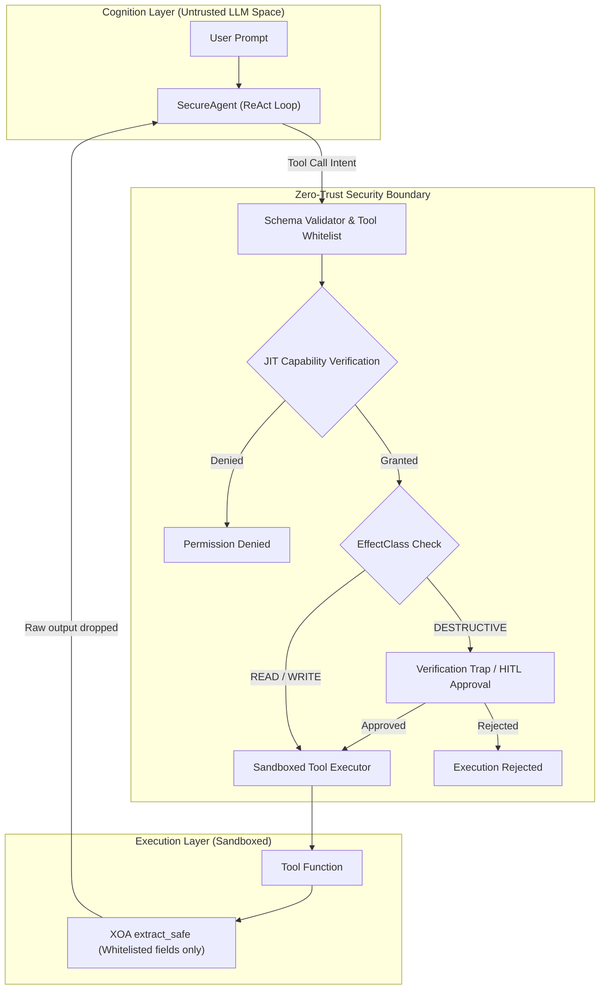

# ModueAgent

[](LICENSE)
[](https://www.python.org/downloads/)
[](pyproject.toml)

🌐 **Language: [English](README.md) | [한국어](README_KO.md)**

**ModueAgent** is a **Zero-Trust AI Agent Framework** built on the microkernel security principles of [ModueHarness](https://github.com/JeaMinLim/ModueHarness).

While 1st-generation agent frameworks (LangChain, AutoGPT, CrewAI) rely on fragile prompt instructions ("*please do not execute dangerous commands*"), ModueAgent treats the LLM as an **untrusted entity that can be cognitively hijacked at any moment via Indirect Prompt Injection**. Security is structurally enforced via microkernel boundaries, ephemeral capabilities, output sandboxing, and resource budgets.

---

## 📚 Documentation

- 🛠️ **[Developer Manual & Architecture Guide](docs/DEVELOPER_GUIDE.md)**: End-to-end guide on building secure agents, feature stacking workflow, mental models, and anti-patterns.
- 🇰🇷 **[개발자 매뉴얼 (한국어)](docs/DEVELOPER_GUIDE_KO.md)**: 기능 빌드업 4계층 순서, 핵심 보안 설계 원칙 및 배포 체크리스트.

---

## 🛡️ Why ModueAgent?

AI agents executing real-world actions (web fetch, file system, API, shell) face severe attack vectors:
- **Indirect Prompt Injection & Cognitive Hijacking**: Untrusted web pages or documents hijack the agent's reasoning, turning it into a *Confused Deputy*.
- **Arbitrary Code Execution (RCE)**: Monolithic frameworks grant unrestricted shell or `eval()` access, leading to full host takeover when poisoned.
- **Credential & Secret Leaking**: Raw tool outputs carrying environment variables or API keys are directly injected into prompt context and exfiltrated.
- **Denial of Wallet (DoW)**: Malicious injection triggers infinite loops, racking up massive API billing overnight.

### How ModueAgent Solves This
1. **Cognition & Action Physical Separation**: The LLM's natural language reasoning and the tool execution environments are separated by strict capability checks.
2. **Object Capability (Zero-Trust JIT Tokens)**: No permanent global tool permissions. Ephemeral tokens with tight TTLs (60s to 10m) are issued JIT per step and immediately revoked.
3. **Side-Effect Classification (`EffectClass`)**: Tools are categorized into `READ` (3600s TTL, cached), `WRITE` (600s TTL), and `DESTRUCTIVE` (60s TTL). Destructive actions trigger mandatory **Verification Traps** before execution.
4. **XOA (Execute-Only Architecture) Output Sandboxing**: Tools only expose strictly whitelisted fields (`extract_paths`) via a safe JSONPath-lite walker. **Raw tool outputs are immediately dropped from memory**, preventing secret leakage.
5. **AST Safe Evaluation & Zero Dependencies**: Math evaluation eliminates `eval()`/`exec()` via an AST node whitelist. The core framework has zero third-party dependencies, protecting against supply-chain poisoning.
6. **Denial-of-Wallet Budgets**: Hard limits on execution steps (`max_steps`) and token counts (`max_tokens`) force clean circuit-breaking and safe fallback synthesis.

---

## 🤖 Unified AI Assistant Support (`AGENTS.md`)

ModueAgent is designed to be co-developed with leading AI coding tools. **[AGENTS.md](AGENTS.md)** serves as the central **Single Source of Truth (SSOT)**, with lightweight bridges connecting seamlessly to:

- **Claude Code**: `CLAUDE.md`
- **Cursor**: `.cursorrules` & `.cursor/rules/modueagent.mdc`
- **GitHub Copilot**: `.github/copilot-instructions.md`
- **Google Gemini & Antigravity**: `GEMINI.md`
- **Cortex & Open Agents**: Native `AGENTS.md` detection

Run the assistant verification script to ensure all configurations are in sync:
```bash
python3 scripts/bootstrap_tools.py
```

---

## 🏗️ Architecture



---

## 🚀 Quickstart

### 1. Installation
```bash
git clone https://github.com/JeaMinLim/ModueAgent.git
cd ModueAgent
pip install -e .
```

### 2. Define Tools and Run Secure Agent
```python
from modueagent import SecureAgent, tool, EffectClass, Budget

# 1. Define a tool with side-effect classification and XOA field extraction
@tool(
    name="get_stock_price",
    description="Fetch stock price.",
    effect_class=EffectClass.READ,                      # Query-only, cacheable
    extract_paths={"ticker": "data.symbol", "price": "data.price"}  # Raw secrets dropped!
)
def get_stock_price(symbol: str) -> dict:
    return {
        "data": {"symbol": symbol.upper(), "price": 182.5},
        "internal_api_key": "SK_LIVE_DO_NOT_EXPOSE",    # Stripped by XOA
    }

# 2. Configure SecureAgent with explicit whitelist and resource budget
agent = SecureAgent(
    name="FinancialAgent",
    tools=[get_stock_price],
    allowed_tools=["get_stock_price"],                  # Strict whitelist
    budget=Budget(max_steps=5, max_tokens=2000),        # Prevents Denial of Wallet
)

# 3. Execute
answer = agent.run("What is the stock price of AAPL?")
print(answer)
```

### 3. Run Example
```bash
PYTHONPATH=src python3 examples/quickstart.py
```

### 4. Run Test Suite
```bash
PYTHONPATH=src python3 -m unittest discover -s tests -p "test_*.py" -v
```

---

## 🗺️ Roadmap

- **v0.1.0** (Current): Core Zero-Trust capability engine, `@tool` with `EffectClass` & XOA, `SecureAgent`, `SecureRuntime`, and unified `AGENTS.md` assistant bootstrap.
- **v0.2.0**: Dynamic Taint Tracking (`TAINTED` context state on external input) and Human-in-the-Loop (HITL) CLI/Web approval hooks.
- **v0.3.0**: Dual-LLM Cognitive Isolation (Privileged Planner vs. Quarantined Worker).
- **v0.4.0**: Native ModueHarness Central Microkernel RPC connector.

---

## 📄 License

This project is licensed under the [Apache 2.0 License](LICENSE).
