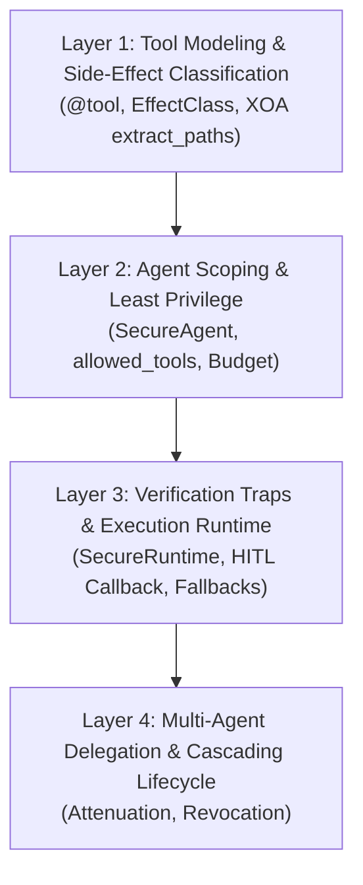

# ModueAgent Developer Guide & Architecture Manual

Welcome to the **ModueAgent Developer Manual**. This guide provides an end-to-end walkthrough on how to build production-grade, secure-by-design AI agents using ModueAgent, built upon [ModueHarness Microkernel Security Principles](MODUEHARNESS_PRINCIPLES.md).

🌐 **Language: [English](DEVELOPER_GUIDE.md) | [한국어](DEVELOPER_GUIDE_KO.md)**

---

## 1. Core Mental Model: The Invariant of Untrusted Cognition

Before writing code in ModueAgent, developers must adopt one foundational mental model:

> **"The LLM is an untrusted cognitive engine."**

In standard software architectures, the code is trusted and external input is untrusted. In an AI agent system, **the LLM itself can be hijacked at runtime** through Indirect Prompt Injection (malicious instructions concealed within emails, fetched websites, database rows, or code comments).

```text
[Untrusted Web Page / DB] ──(Indirect Prompt Injection)──> [LLM Agent (Hijacked)]
                                                                    │
                                                     (Malicious Tool Call Attempt)
                                                                    │
                                                                    ▼
                                               [ModueAgent Security Boundary]
                                               ├─ 1. Whitelist Check (allowed_tools)
                                               ├─ 2. JIT Capability Token Verification
                                               ├─ 3. EffectClass Trap (DESTRUCTIVE approval)
                                               ├─ 4. XOA Sandboxing (Extract & Drop Raw)
                                               └─ 5. Resource Budget Guardrail (Max Steps)
```

Therefore:
1. **Never rely on system prompts for security.** Prompt guardrails will inevitably fail against clever adversarial inputs.
2. **Security must be structurally enforced by code.** Tools, capabilities, and budgets must enforce boundaries deterministically.

---

## 2. The 4-Layer Stacking Workflow

When developing an AI agent system with ModueAgent, always stack features in this exact order:



---

### Layer 1: Tool Modeling & Side-Effect Classification

Every external action the agent can perform must be wrapped in a `@tool` decorator.

#### Step 1.1: Determine the `EffectClass`
Ask: *"If an attacker tricks the agent into calling this tool, what is the blast radius?"*

- **`EffectClass.READ`** (Safe / Query-Only):
  - No side effects on system state (e.g. search, calculate, query DB).
  - Maximum TTL: 3600 seconds. Results are safe to cache.
- **`EffectClass.WRITE`** (State Change / Reversible):
  - Modifies state but can be rolled back or revised (e.g. creating draft documents, updating cache, sending notifications).
  - Maximum TTL: 600 seconds. Not cacheable.
- **`EffectClass.DESTRUCTIVE`** (Irreversible / High Impact):
  - Hard or impossible to reverse (e.g. deleting files, dropping tables, transferring money, modifying user permissions).
  - Maximum TTL: 60 seconds. **Triggers mandatory Verification Traps before execution.**

#### Step 1.2: Define XOA `extract_paths` (Execute-Only Sandboxing)
Never pass raw API/database payloads back into the LLM context. Internal server IDs, auth tokens, and sensitive fields must be discarded immediately.

```python
from modueagent import tool, EffectClass

@tool(
    name="query_order",
    description="Look up order status for a customer.",
    effect_class=EffectClass.READ,
    # XOA: Only expose these 3 fields. Everything else in the raw dict is permanently dropped from memory!
    extract_paths={
        "order_id": "data.id",
        "status": "data.delivery_status",
        "item_count": "data.items[].id",
    }
)
def query_order(order_id: str) -> dict:
    return {
        "data": {
            "id": order_id,
            "delivery_status": "Shipped",
            "items": [{"id": "item-1"}, {"id": "item-2"}],
        },
        # These will be stripped by XOA:
        "customer_credit_card": "4111-XXXX-XXXX-1234",
        "database_connection_ip": "10.140.0.12",
    }
```

---

### Layer 2: Agent Scoping & Least Privilege

Once tools are defined, assemble a `SecureAgent`.

#### Step 2.1: Enforce the `allowed_tools` Whitelist
Even if 20 tools exist in the system, an individual agent should only have access to the exact subset required for its role:

```python
from modueagent import SecureAgent, Budget

agent = SecureAgent(
    name="CustomerSupportAgent",
    system_prompt="You assist customers with order status inquiries.",
    tools=[query_order, cancel_order, refund_payment],
    # Even if an attacker injects a prompt saying 'Refund order 123', refund_payment is blocked!
    allowed_tools=["query_order", "cancel_order"],
    # Protect against infinite billing loops (Denial-of-Wallet)
    budget=Budget(max_steps=5, max_tokens=4000),
)
```

#### Step 2.2: Set Hard Resource Budgets
Always define a `Budget`:
- `max_steps`: Maximum number of ReAct reasoning/action cycles (e.g. 5–10).
- `max_tokens`: Maximum accumulated token budget for the session.
- When exhausted, ModueAgent immediately stops and invokes `_synthesize_partial_answer` to return a safe partial response rather than failing or looping indefinitely.

---

### Layer 3: Verification Traps & Execution Runtime

For sensitive workflows involving `EffectClass.DESTRUCTIVE` tools, integrate human-in-the-loop (HITL) or secondary verification callbacks.

```python
from modueagent import SecureRuntime

def human_approval_callback(tool_name: str, arguments: dict) -> bool:
    """Invoked whenever a DESTRUCTIVE tool is requested."""
    print(f"\n⚠️  SECURITY INTERCEPTION: Destructive action requested!")
    print(f"Tool: {tool_name} | Args: {arguments}")
    confirm = input("Authorize execution? [y/N]: ").strip().lower()
    return confirm == "y"

# Bind the verification callback to the runtime
runtime = SecureRuntime(
    agent=agent,
    verification_callback=human_approval_callback,
)

response = runtime.run("Please cancel order ORD-9921.")
```

---

### Layer 4: Multi-Agent Delegation & Cascading Lifecycle

When building multi-agent architectures (e.g. a Manager Agent delegating to a Worker Agent):

1. **Permission Attenuation**: A delegated token can only inherit a subset of the parent's permissions (`parent & requested`). A worker cannot be delegated permissions the manager does not have.
2. **TTL Attenuation**: The child's expiration time can never exceed the parent's expiration time (`min(parent_expiry, candidate_expiry)`).
3. **Cascading Revocation**: When the user session or parent task completes, revoking the parent token automatically invalidates all delegated descendant tokens across the entire tree.

---

## 3. Real-World Architecture Example: Secure E-Commerce Assistant

Here is a complete, runnable example demonstrating the 4 layers working in harmony:

```python
from modueagent import SecureAgent, SecureRuntime, tool, EffectClass, Budget

# 1. READ Tool (Safe, cacheable)
@tool(
    name="get_product_stock",
    description="Check remaining stock for a SKU.",
    effect_class=EffectClass.READ,
    extract_paths={"sku": "sku", "available": "stock.qty"}
)
def get_product_stock(sku: str) -> dict:
    return {"sku": sku, "stock": {"qty": 14}, "internal_warehouse_id": "wh-east-01"}

# 2. DESTRUCTIVE Tool (Irreversible, requires approval)
@tool(
    name="apply_discount",
    description="Apply permanent promotional store credit to user account.",
    effect_class=EffectClass.DESTRUCTIVE,
    extract_paths={"credit_applied": "amount", "status": "status"}
)
def apply_discount(user_id: str, amount: int) -> dict:
    return {"user_id": user_id, "amount": amount, "status": "applied"}

# 3. Secure Agent Definition
agent = SecureAgent(
    name="StoreAgent",
    tools=[get_product_stock, apply_discount],
    allowed_tools=["get_product_stock", "apply_discount"],
    budget=Budget(max_steps=4),
)

# 4. Human-in-the-Loop Trap
def security_trap(tool_name: str, args: dict) -> bool:
    if tool_name == "apply_discount" and args.get("amount", 0) > 50:
        print(f"🚨 High-value discount alert! Requires explicit confirmation.")
        return False  # Reject high-risk action
    return True

runtime = SecureRuntime(agent=agent, verification_callback=security_trap)
```

---

## 4. Automated Security Verification & CI/CD Testing

ModueAgent provides an **automated zero-trust security auditor** (`AgentSecurityAuditor`) and testing utilities (`SecurityTestCase`) so that developers and CI/CD pipelines can rigorously verify compliance before deploying an agent to production.

### 4.1 Single-Line Unit Testing with `SecurityTestCase`
Developers can inherit from `SecurityTestCase` in their test suites to verify an agent in a single assertion:

```python
from modueagent.testing import SecurityTestCase
from my_project.agent import support_agent

class TestAgentCompliance(SecurityTestCase):
    def test_support_agent_security(self):
        # Automatically audits:
        # 1. EffectClass misclassifications (e.g. destructive actions labeled READ)
        # 2. XOA extract_paths compliance
        # 3. Denial-of-Wallet budget constraints
        # 4. AST code inspection for eval(), exec(), and os.system()
        # 5. Red-team adversarial prompt injection simulation
        self.assertAgentSecure(support_agent)
```

### 4.2 CLI Security Auditing (`scripts/audit_agent.py`)
Audit any agent file directly from the terminal or CI pipeline:

```bash
python3 scripts/audit_agent.py path/to/my_agent.py
```

---

## 5. Anti-Patterns & Security Checklist

### ❌ Anti-Patterns to Avoid

| Anti-Pattern | Why It Is Dangerous | ModueAgent Alternative |
| :--- | :--- | :--- |
| **`eval()` or `exec()` for math/code** | Allows direct Python sandbox escape & RCE | Use `safe_eval_arithmetic()` |
| **Omitting `extract_paths`** | Exposes raw credentials, secrets, & paths to LLM | Declare `extract_paths` or `Scriptability.READ_REQUIRED` |
| **Granting `tool:*` wildcard** | Overprivileges the agent; any hijacked tool can be invoked | Whitelist explicit tool names (`tool:search`, `tool:fetch`) |
| **Marking deletion tools as `EffectClass.READ`** | Bypasses the 60s TTL and verification traps | Always mark destructive actions as `EffectClass.DESTRUCTIVE` |
| **Unbounded loops without a `Budget`** | Risks infinite billing attacks (Denial-of-Wallet) | Set `Budget(max_steps=5, max_tokens=10000)` |

---

### ✅ Production Deployment Checklist

- [ ] All tools are categorized with accurate `EffectClass` (`READ`, `WRITE`, `DESTRUCTIVE`).
- [ ] Every non-read-required tool specifies explicit XOA `extract_paths`.
- [ ] Agents only contain strictly needed tools in `allowed_tools`.
- [ ] A `Budget` with realistic `max_steps` and `max_tokens` is configured.
- [ ] `verification_callback` is attached to `SecureRuntime` for `DESTRUCTIVE` actions.
- [ ] No `eval()`, `exec()`, or unverified subprocesses exist in tool implementations.
- [ ] All unit tests pass: `PYTHONPATH=src python3 -m unittest discover tests`.
