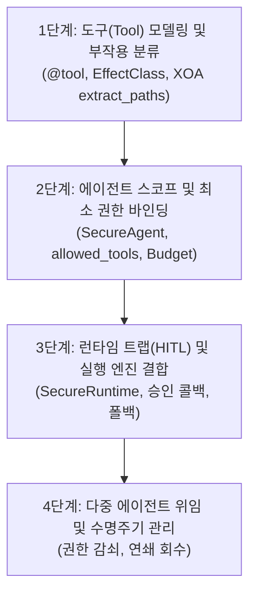

# ModueAgent 개발자 가이드 & 아키텍처 매뉴얼

**ModueAgent 개발자 매뉴얼**에 오신 것을 환영합니다. 이 문서는 [ModueHarness 마이크로커널 보안 설계 원칙](MODUEHARNESS_PRINCIPLES_KO.md)을 바탕으로 ModueAgent 프레임워크를 사용하여 안전하고 견고한 프로덕션급 AI 에이전트를 구축할 때 **기능을 어떤 순서로 쌓아 올려야 하는지**, 그리고 **반드시 지켜야 하는 핵심 설계 원칙**이 무엇인지 안내합니다.

🌐 **Language: [English](DEVELOPER_GUIDE.md) | [한국어](DEVELOPER_GUIDE_KO.md)**

---

## 1. 핵심 멘탈 모델: "LLM은 신뢰할 수 없는 엔티티다"

ModueAgent로 코드를 작성하기 전, 개발자는 다음 대원칙을 먼저 확립해야 합니다:

> **"LLM(언어 모델)은 인지 납치(Cognitive Hijacking)될 수 있는 비신뢰 추론 엔진이다."**

전통적인 웹/앱 소프트웨어에서는 '내가 작성한 코드'는 신뢰하고 '외부 유저의 입력'만 검증하면 되었습니다. 그러나 AI 에이전트 시스템에서는 **에이전트의 두뇌(LLM) 자체가 공격자의 꼭두각시(Confused Deputy)로 탈취**될 수 있습니다 (외부 웹페이지, 문서, DB 데이터 속에 숨겨진 간접 프롬프트 주입 공격 등).

```text
[오염된 웹/DB 데이터] ──(간접 프롬프트 주입)──> [LLM 에이전트 (세뇌/탈취됨)]
                                                        │
                                            (악의적 도구 호출 시도: DB 삭제 등)
                                                        │
                                                        ▼
                                           [ModueAgent 보안 커널 경계]
                                           ├─ 1. 화이트리스트 검사 (allowed_tools)
                                           ├─ 2. JIT 객체 역량 토큰 검증
                                           ├─ 3. EffectClass 트랩 (DESTRUCTIVE 승인)
                                           ├─ 4. XOA 샌드박싱 (필드 추출 & 원본 폐기)
                                           └─ 5. 자원 예산 가드레일 (Max Steps 제어)
```

따라서:
1. **시스템 프롬프트에 보안을 의존하지 마십시오.** ("악성 명령을 실행하지 마라"는 자연어 프롬프트는 적대적 공격에 반드시 뚫립니다.)
2. **보안은 반드시 코드와 커널 구조로 강제되어야 합니다.** 도구 권한, 토큰 수명, 필드 격리, 실행 예산을 시스템 차원에서 강제해야 합니다.

---

## 2. 기능을 쌓아 올리는 4단계 워크플로우 (4-Layer Stacking)

ModueAgent로 에이전트를 개발할 때는 항상 아래의 **4계층 순서**대로 기능을 빌드업하십시오:



---

### [1단계] 도구(Tool) 모델링 및 부작용 분류

에이전트가 외부 세계와 상호작용하는 모든 함수는 `@tool` 데코레이터로 감싸야 합니다.

#### 1.1 `EffectClass` (부작용 등급) 결정
*"공격자가 에이전트를 속여 이 도구를 마음대로 호출했을 때 시스템에 어떤 피해가 발생하는가?"*를 질문하십시오:

- **`EffectClass.READ`** (조회 전용 / 안전):
  - 시스템 상태를 전혀 변경하지 않는 안전한 작업 (예: 검색, 통계 조회, 계산).
  - 최대 허용 수명: 3600초 (1시간). 결과 캐싱 허용.
- **`EffectClass.WRITE`** (상태 변경 / 가역적):
  - 시스템 상태를 바꾸지만 롤백이나 재작업이 가능한 작업 (예: 임시 파일 생성, 캐시 업데이트, 알림 전송).
  - 최대 허용 수명: 600초 (10분). 캐싱 불가.
- **`EffectClass.DESTRUCTIVE`** (파괴적 / 비가역적):
  - 실행 후 원상복구가 불가능하거나 파급력이 큰 작업 (예: 파일 삭제, DB 테이블 드롭, 계좌 이체, 권한 변경).
  - 최대 허용 수명: 60초 (초단기). **실행 전 검증 트랩(Verification Trap) 또는 인간 승인 강제.**

#### 1.2 XOA `extract_paths` 정의 (Execute-Only Sandboxing)
도구의 원시 반환값(raw dictionary)을 LLM에 그대로 넘기면 사내 환경변수, 내부 IP, 민감 키가 프롬프트로 유출됩니다. 반드시 노출할 필드만 정의하십시오:

```python
from modueagent import tool, EffectClass

@tool(
    name="query_order",
    description="주문 번호로 배송 상태를 조회합니다.",
    effect_class=EffectClass.READ,
    # XOA: 오직 아래 3개 필드만 모델에 전달됩니다. 원본에 포함된 카드번호, 내부 IP는 즉시 메모리에서 삭제됩니다!
    extract_paths={
        "order_id": "data.id",
        "status": "data.delivery_status",
        "items": "data.items[].name",
    }
)
def query_order(order_id: str) -> dict:
    return {
        "data": {
            "id": order_id,
            "delivery_status": "배송중",
            "items": [{"name": "무선 마우스"}, {"name": "기계식 키보드"}],
        },
        # 아래 정보는 XOA에 의해 자동 폐기되어 LLM에 전달되지 않습니다:
        "customer_card_number": "4111-XXXX-XXXX-1234",
        "internal_server_ip": "10.0.4.15",
    }
```

---

### [2단계] 에이전트 스코프 및 최소 권한 바인딩

도구가 준비되면 에이전트의 역할에 맞추어 `SecureAgent`를 조립합니다.

#### 2.1 도구 화이트리스트(`allowed_tools`) 강제
시스템에 20개의 도구가 있더라도, 해당 에이전트의 역할에 필요한 최소 도구만 화이트리스트로 바인딩해야 합니다:

```python
from modueagent import SecureAgent, Budget

agent = SecureAgent(
    name="CustomerServiceAgent",
    system_prompt="고객의 주문 상태 조회를 돕는 안내원입니다.",
    tools=[query_order, cancel_order, refund_money],
    # 공격자가 '100만원 환불해줘'라고 에이전트를 세뇌해도, refund_money는 원천 차단됩니다!
    allowed_tools=["query_order", "cancel_order"],
    # 과금 테러 방지 예산 설정
    budget=Budget(max_steps=5, max_tokens=4000),
)
```

#### 2.2 자원 예산(`Budget`) 설정
- `max_steps`: ReAct 루프의 최대 실행 스텝 수 (보통 5~10회).
- `max_tokens`: 세션 내 누적 사용 토큰 한도.
- 한도 초과 시 무한 루프 과금 공격을 방지하고 `_synthesize_partial_answer`를 통해 현재까지 확인된 사실만으로 안전한 요약 답변을 반환합니다.

---

### [3단계] 런타임 트랩(HITL) 및 실행 엔진 결합

`DESTRUCTIVE` 도구가 포함된 워크플로우에는 최종 사용자의 승인을 받는 콜백(Human-in-the-Loop)을 연결합니다.

```python
from modueagent import SecureRuntime

def human_approval_callback(tool_name: str, arguments: dict) -> bool:
    """파괴적 도구가 호출되려 할 때 커널이 자동으로 이 콜백을 인터셉트합니다."""
    print(f"\n⚠️ [보안 경고] 파괴적 도구 실행 요청 감지!")
    print(f"도구명: {tool_name} | 인자: {arguments}")
    confirm = input("이 작업을 실제로 승인하시겠습니까? [y/N]: ").strip().lower()
    return confirm == "y"

runtime = SecureRuntime(
    agent=agent,
    verification_callback=human_approval_callback,
)

response = runtime.run("ORD-1234 주문 취소해줘.")
```

---

### [4단계] 다중 에이전트 위임 및 수명주기 관리

매니저 에이전트가 서브 에이전트에게 권한을 위임할 때의 원칙:

1. **권한 감쇠 (Permission Attenuation)**: 자식 토큰은 부모 토큰이 가진 권한의 교집합(`parent & requested`)만 가질 수 있습니다. 부모에게 없는 권한을 자식에게 줄 수 없습니다.
2. **수명 감쇠 (TTL Attenuation)**: 자식 토큰의 만료 시간은 부모 토큰의 만료 시간을 초과할 수 없습니다.
3. **연쇄 회수 (Cascading Revocation)**: 태스크나 부모 세션이 종료되면 `revoke_capability(root_id)` 한 번으로 파생된 모든 하위 에이전트의 토큰이 트리 전체에서 일괄 파기됩니다.

---

## 3. 실전 아키텍처 예제: 보안 이커머스 어시스턴트

```python
from modueagent import SecureAgent, SecureRuntime, tool, EffectClass, Budget

# 1. READ 도구 (조회 전용, 캐싱 허용)
@tool(
    name="get_stock",
    description="상품 재고를 확인합니다.",
    effect_class=EffectClass.READ,
    extract_paths={"sku": "sku", "qty": "stock.count"}
)
def get_stock(sku: str) -> dict:
    return {"sku": sku, "stock": {"count": 12}, "warehouse_id": "wh-01"}

# 2. DESTRUCTIVE 도구 (비가역적 할인 지급, 승인 필요)
@tool(
    name="grant_voucher",
    description="고객 계정에 프로모션 포인트를 지급합니다.",
    effect_class=EffectClass.DESTRUCTIVE,
    extract_paths={"points": "points", "status": "status"}
)
def grant_voucher(user_id: str, points: int) -> dict:
    return {"user_id": user_id, "points": points, "status": "granted"}

# 3. 에이전트 정의
agent = SecureAgent(
    name="StoreAgent",
    tools=[get_stock, grant_voucher],
    allowed_tools=["get_stock", "grant_voucher"],
    budget=Budget(max_steps=5),
)

# 4. 보안 트랩 콜백
def store_security_trap(tool_name: str, args: dict) -> bool:
    if tool_name == "grant_voucher" and args.get("points", 0) > 10000:
        print("🚨 10,000 포인트 초과 지급은 관리자 수동 승인이 필요합니다.")
        return False
    return True

runtime = SecureRuntime(agent=agent, verification_callback=store_security_trap)
```

---

## 4. 자동화된 보안 검증 & CI/CD 테스트

ModueAgent는 개발자와 CI/CD 파이프라인이 에이전트를 프로덕션에 배포하기 전에 제로 트러스트 보안 원칙을 완벽히 지켰는지 자동으로 검증할 수 있는 **보안 감사 도구**(`AgentSecurityAuditor`) 및 테스트 프레임워크(`SecurityTestCase`)를 제공합니다.

### 4.1 단 한 줄로 끝내는 유닛테스트 (`SecurityTestCase`)
테스트 스위트에서 `SecurityTestCase`를 상속받으면 단 한 줄의 assertion으로 에이전트의 보안성을 전수 검사합니다:

```python
from modueagent.testing import SecurityTestCase
from my_project.agent import support_agent

class TestAgentCompliance(SecurityTestCase):
    def test_support_agent_security(self):
        # 자동으로 다음 항목들을 전수 감사:
        # 1. EffectClass 오분류 탐지 (예: delete/drop이 포함되었는데 READ로 지정한 결함)
        # 2. XOA extract_paths 누락 여부
        # 3. 과금 테러 방지 Budget 설정 여부
        # 4. AST 정적 분석: eval(), exec(), os.system() 위험 호출 사용 여부
        # 5. 비인가 도구 호출 시뮬레이션(레드팀 인젝션 내성)
        self.assertAgentSecure(support_agent)
```

### 4.2 터미널 CLI 보안 감사 도구 (`scripts/audit_agent.py`)
CI/CD 파이프라인이나 터미널에서 에이전트 파일을 지정하여 즉시 검사할 수 있습니다:

```bash
python3 scripts/audit_agent.py path/to/my_agent.py
```

출력 예시:
```text
=== Security Audit Report for 'CustomerSupportAgent' ===
Status: PASSED ✅
Total Findings: 0
```

만약 파괴적 작업이 잘못 지정되었거나 `eval()`이 포함되어 있다면:
```text
=== Security Audit Report for 'RiskyAgent' ===
Status: FAILED ❌
Total Findings: 1
  [CRITICAL] (SEC-EFFECT-MISCLASSIFIED) delete_user: Tool name contains destructive keyword(s) ['delete'] but effect_class is 'read'. This bypasses 60s TTL and verification traps!
```

---

## 5. 안티 패턴 및 배포 체크리스트

### ❌ 피해야 할 안티 패턴

| 안티 패턴 | 위험한 이유 | ModueAgent 권장 해결책 |
| :--- | :--- | :--- |
| **`eval()` 또는 `exec()` 사용** | 파이썬 샌드박스 탈출 및 원격 코드 실행(RCE) | `safe_eval_arithmetic()` 사용 |
| **`extract_paths` 누락** | DB 원본 객체, 사내 IP, 시크릿이 LLM 프롬프트로 노출 | 명시적 `extract_paths` 지정 |
| **`tool:*` 와일드카드 권한 부여** | 과도한 권한으로 인해 세뇌된 모델이 모든 도구 임의 실행 | 개별 도구 단위 정밀 토큰 강제 |
| **삭제 도구를 `EffectClass.READ`로 지정** | 60초 TTL 제한과 사전 검증 트랩을 우회함 | 파괴적 작업은 반드시 `DESTRUCTIVE` 지정 |
| **`Budget` 없이 무한 루프 방치** | 공격자의 반복 호출 지시로 인한 API 요금 폭탄 (DoW) | `Budget(max_steps=5)` 상한 강제 |

---

### ✅ 프로덕션 배포 체크리스트

- [ ] 모든 도구가 올바른 `EffectClass`(`READ`, `WRITE`, `DESTRUCTIVE`)로 분류되었는가?
- [ ] 조회가 아닌 모든 도구에 명시적인 `extract_paths`가 선언되었는가?
- [ ] 에이전트별 `allowed_tools`에 필수 도구만 최소 권한으로 등록되었는가?
- [ ] 현실적인 `max_steps`와 `max_tokens`를 가진 `Budget`이 설정되었는가?
- [ ] `DESTRUCTIVE` 도구에 대한 `verification_callback` (인간 승인 또는 2차 검증)이 연결되었는가?
- [ ] 도구 구현 코드 내에 `eval()`, `exec()`, 비검증 `subprocess`가 없는가?
- [ ] 모든 단위 테스트가 통과하는가 (`PYTHONPATH=src python3 -m unittest discover tests`)?
