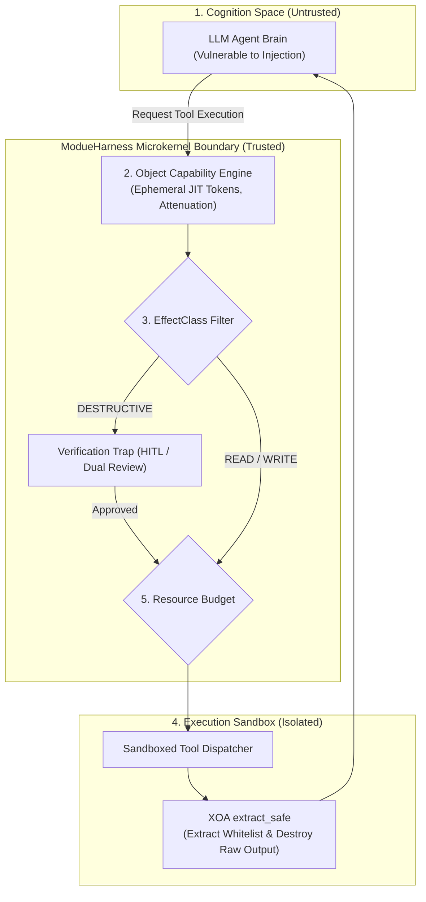

# ModueHarness Microkernel Security Principles & Philosophy

This document outlines the architectural philosophy, core invariants, and microkernel security foundations derived from the **ModueHarness** agent operating system infrastructure.

🌐 **Language: [English](MODUEHARNESS_PRINCIPLES.md) | [한국어](MODUEHARNESS_PRINCIPLES_KO.md)**

---

## 1. The Core Axiom: Untrusted Cognition

Traditional cybersecurity models operate on a perimeter defense assumption: trusted internal components vs. untrusted external network traffic. 

In AI agent systems, this assumption fails catastrophically:

> **"LLM cognition cannot be trusted as an authorization boundary."**

Because Large Language Models process system instructions, developer logic, and external untrusted content through the same unstructured natural language token stream, **they are inherently vulnerable to Indirect Prompt Injection (IPI)**. An attacker concealing instructions in an email, a web page, or a source code comment can hijack the model's intent, turning the agent into a **Confused Deputy**.

Therefore, ModueHarness established a non-negotiable architectural rule:
**Security must never rely on prompt guidance ("Please do not execute dangerous commands"). It must be structurally enforced by microkernel boundaries, cryptographic object capabilities, and sandboxed execution.**

---

## 2. The 5 Foundational Principles of ModueHarness

### Principle 1: Physical & Logical Boundary (Liedtke / seL4 Minimality)
- **Separation of Concerns**: Cognition (natural language reasoning) runs in user space, while tool execution and resource scheduling run within protected boundaries.
- **Fail-Closed Isolation**: If the model is completely compromised, it cannot make arbitrary system calls or invoke unauthorized network sockets because it lacks OS-level handles.

### Principle 2: Zero-Trust Object Capability (OCap) Security
- **No Global Long-Lived Privileges**: Agents hold zero persistent rights.
- **JIT (Just-In-Time) Ephemeral Tokens**: Temporary capability tokens with strict time-to-live (TTL) limits are issued only when a specific action is scheduled, and are revoked immediately upon completion.
- **Monotonic Attenuation**: When a parent task delegates a capability to a child or sub-agent, permissions can only be narrowed (`parent & requested`). A sub-agent cannot hold permissions or TTLs greater than its parent.
- **Cascading Revocation**: Revoking a parent token recursively and instantaneously invalidates all delegated descendant tokens across the entire tree.
- **Anti-Wildcard Invariant**: Wildcards like `tool:*` are strictly rejected by the kernel. Every tool capability must be granted with explicit, granular naming (`tool:query_order`).

### Principle 3: Side-Effect Classification (`EffectClass`) & Verification Traps
Every tool capability must be classified by its reversibility:
- **`READ`**: Safe, query-only operations (TTL <= 3600s). Results are safe to cache.
- **`WRITE`**: Reversible state changes (TTL <= 600s). Not cacheable.
- **`DESTRUCTIVE`**: Irreversible state alterations (file deletion, table drops, financial transfers, permission changes). Bound to an ultra-short TTL (<= 60s) and **guarded by mandatory Verification Traps (independent secondary LLM checks or Human-in-the-Loop approvals)**.

### Principle 4: XOA (Execute-Only Architecture) Output Sandboxing
Tool execution results often contain raw system paths, database credentials, or unintended personal data.
- **Field Whitelisting (`extract_paths`)**: Only explicitly declared fields are extracted using safe JSONPath-lite traversals (`extract_safe`).
- **Immediate In-Memory Destruction**: The raw output (`raw_output`) is permanently discarded from memory. It is never passed into the agent's prompt context, closing data-exfiltration side channels.

### Principle 5: Denial-of-Wallet (DoW) & Starvation Prevention
- **Deterministic Resource Budgets**: Hard execution ceilings (`max_steps`) and token counters (`max_tokens`) prevent poisoned agents from spinning in infinite tool-invocation loops.
- **Safe Fallback Synthesis**: If a budget is exhausted, the framework does not crash or loop indefinitely; it terminates tool execution and synthesizes the best-effort response strictly from verified history.

---

## 3. Relationship: ModueHarness vs. ModueAgent

| Layer | System | Role & Analogy |
| :--- | :--- | :--- |
| **Kernel Space** | **ModueHarness** | **Agent Operating System (Microkernel)** Manages multi-process isolation, low-level IPC channels, EEVDF 4D task scheduling, and centralized capability verification. |
| **User Space** | **ModueAgent** | **Developer Framework & High-Level SDK** Provides declarative `@tool` decorators, `SecureAgent` constructs, ReAct execution loops, and automated compliance auditing (`SecurityTestCase`). |

By embedding ModueHarness's zero-trust security invariants directly into the developer workflow, **ModueAgent** allows developers to build AI agents that are mathematically constrained from causing catastrophic system harm—even when their cognitive reasoning is hijacked.
