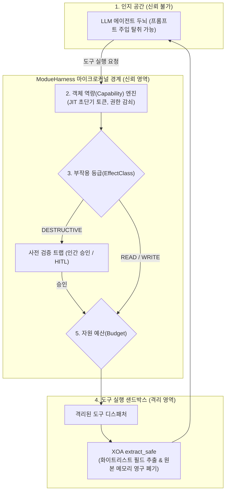

# ModueHarness 마이크로커널 보안 설계 원칙 및 철학

이 문서는 **ModueHarness(모두의하네스)** 에이전트 운영체제 마이크로커널 인프라에서 수립된 아키텍처 철학, 핵심 보안 불변식, 그리고 마이크로커널 설계 원칙을 상세히 설명합니다.

🌐 **Language: [English](MODUEHARNESS_PRINCIPLES.md) | [한국어](MODUEHARNESS_PRINCIPLES_KO.md)**

---

## 1. 근본 공리: "LLM의 인지는 신뢰할 수 없다"

전통적인 사이버 보안 모델은 "내부의 신뢰 영역(컴포넌트) vs 외부의 비신뢰 영역(네트워크)"이라는 경계 방어 가정에 기반합니다.

그러나 AI 에이전트 시스템에서는 이 기본 가정이 완전히 무너집니다:

> **"LLM(언어 모델)의 인지는 권한 통제의 경계선으로 신뢰할 수 없다."**

대규모 언어 모델은 개발자의 시스템 지침, 사용자의 프롬프트, 그리고 외부에서 수집한 비신뢰 데이터를 **동일한 비구조화 자연어 토큰 스트림으로 한꺼번에 처리**하기 때문에, **간접 프롬프트 주입(Indirect Prompt Injection, IPI)**에 본질적으로 취약합니다. 공격자가 웹페이지, 이메일, 문서, 코드 주석 속에 악성 지시문을 숨겨두면 모델의 판단력은 즉각 세뇌당하여 공격자의 꼭두각시(**Confused Deputy**)로 전락합니다.

따라서 ModueHarness는 타협할 수 없는 아키텍처 불변식을 세웠습니다:
**"절대 프롬프트('위험한 명령을 실행하지 마시오')에 보안을 의존해서는 안 된다. 보안은 반드시 마이크로커널 물리적 경계, 암호학적 객체 역량(Capability), 그리고 격리된 샌드박스로 강제되어야 한다."**

---

## 2. ModueHarness의 5대 핵심 보안 설계 원칙

### 제1원칙: 인지와 실행의 물리적/논리적 분리 (seL4 최소성 원칙)
- **관심사의 분리**: 자연어 추론(유저 공간)과 도구의 물리적 실행(보호된 커널/도구 공간)을 철저히 격리합니다.
- **Fail-Closed 격리**: 에이전트가 공격자에게 완전히 세뇌당하더라도, 커널이 부여하지 않은 OS 시스템 콜이나 외부 네트워크 연결은 물리적으로 호출할 수 없습니다.

### 제2원칙: Zero-Trust 객체 역량 (Object Capability, OCap) 보안
- **영구적인 만능 권한 배제**: 에이전트는 상시 보유하는 전역 권한이 0개입니다.
- **JIT (Just-In-Time) 일회성 단기 토큰**: 특정 도구를 실행하는 바로 그 순간에만 엄격한 TTL(60초~10분)을 가진 일회성 토큰이 발급되고, 완료 즉시 회수됩니다.
- **단조 권한 감쇠 (Monotonic Attenuation)**: 부모 작업이 하위 에이전트에 권한을 위임할 때 권한은 축소(`parent & requested`)될 수만 있습니다. 자식은 부모의 권한 범위나 잔여 만료 시간을 초과할 수 없습니다.
- **연쇄 회수 (Cascading Revocation)**: 부모 토큰이 취소되면 그로부터 파생된 모든 하위 위임 토큰이 트리 전체에서 즉시 일괄 파기됩니다.
- **와일드카드 금지 (Anti-Wildcard)**: `tool:*` 같은 포괄적 도구 권한은 커널에서 엄격히 거부됩니다. 모든 도구 권한은 `tool:query_order`와 같이 명시적이어야 합니다.

### 제3원칙: 자원 부작용 등급 (`EffectClass`) 및 사전 검증 트랩
모든 도구는 그 부작용의 가역성(Reversibility)에 따라 3단계로 엄격히 분류됩니다:
- **`READ`**: 단순 조회, 부작용 없음 (TTL <= 3600초). 결과 캐싱 허용.
- **`WRITE`**: 가역적 상태 변경, 롤백 가능 (TTL <= 600초). 캐싱 불가.
- **`DESTRUCTIVE`**: 비가역적 파괴 (파일 삭제, DB 테이블 드롭, 계좌 이체 등). 60초 초단기 TTL과 **사전 검증 트랩(독립된 2차 검증 또는 인간 승인 / HITL) 필수 강제**.

### 제4원칙: XOA (Execute-Only Architecture) 출력 샌드박싱
도구 실행 결과(raw output)에는 사내 내부 IP, DB 커넥션 스트링, 민감 개인정보가 포함되어 있는 경우가 많습니다.
- **필드 화이트리스트 (`extract_paths`)**: 안전한 JSONPath-lite 파서(`extract_safe`)를 통해 사전 정의된 필드만 추출합니다.
- **원본 데이터 메모리 즉시 폐기**: 원시 결과(`raw_output`)는 LLM 프롬프트 컨텍스트로 절대 들어가지 않으며, 그 자리에서 즉시 메모리에서 영구 파기하여 시크릿 유출을 원천 차단합니다.

### 제5원칙: 과금 테러(Denial of Wallet, DoW) 및 자원 고갈 방어
- **결정론적 자원 예산**: 스텝 상한(`max_steps`)과 토큰 한도(`max_tokens`)를 커널이 강제하여, 인젝션 공격으로 인한 무한 루프 API 호출을 차단합니다.
- **안전한 부분 요약 폴백**: 한도 도달 시 비정상 중단 대신 지금까지 검증된 히스토리만을 종합하여 안전한 부분 답변(`_synthesize_partial_answer`)을 반환합니다.

---

## 3. ModueHarness와 ModueAgent의 관계

| 계층 | 시스템 | 역할 및 비유 |
| :--- | :--- | :--- |
| **커널 계층 (Kernel Space)** | **ModueHarness** | **에이전트 운영체제 (Microkernel OS)** 멀티프로세스 격리, IPC 메시지 버스, EEVDF 4D 스케줄링, 저수준 Capability 엔진을 호스팅하는 인프라. |
| **유저 계층 (User Space)** | **ModueAgent** | **개발자용 프레임워크 및 SDK (Application Framework)** 개발자가 파이썬 코드로 안전한 도구(`@tool`), 에이전트(`SecureAgent`), 실행 런타임(`SecureRuntime`), 보안 검증 테스트(`SecurityTestCase`)를 작성할 수 있도록 제공하는 프레임워크. |

ModueHarness의 마이크로커널 보안 불변식을 상속받음으로써, **ModueAgent**를 사용하는 개발자는 복잡한 커널 구현을 몰라도 **"인지 납치 공격을 당해도 시스템이 파괴되지 않는 안전한 AI 에이전트"**를 손쉽게 구축할 수 있습니다.
